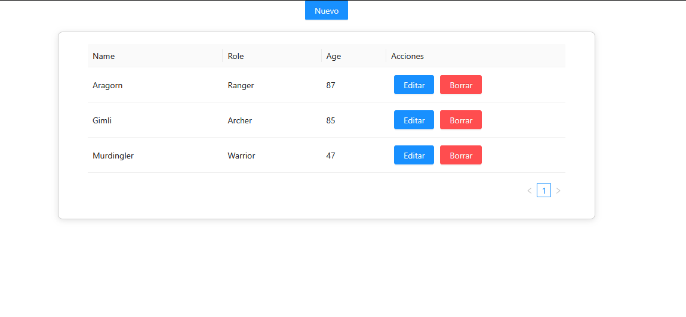
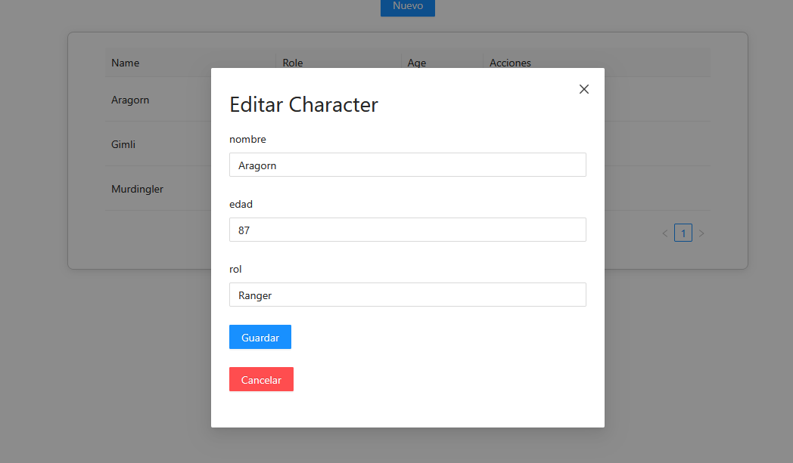

# Angular CRUD – Gestión de Personajes

Aplicación web desarrollada en **Angular 21** que implementa un CRUD completo
(Create, Read, Update, Delete) para la gestión de personajes.

El objetivo del proyecto es demostrar el uso de **arquitectura basada en componentes
standalone**, **manejo de estado con Signals**, **separación de responsabilidades**
y **buenas prácticas en Angular moderno**.

---

## Tecnologías utilizadas

- **Angular 21** (standalone components)
- **TypeScript**
- **Angular Signals** para manejo de estado
- **RxJS**
- **Ng-Zorro Ant Design** (UI components)
- **Reactive Forms**
- **CSS / LESS**

---

## Funcionalidades

- Listado de personajes en tabla con paginación
- Creación de nuevos personajes mediante modal
- Edición de personajes existentes
- Eliminación con estado de carga por fila
- Validaciones de formulario
- Manejo de estados de carga globales y por acción

---

## Arquitectura del proyecto

El proyecto está organizado siguiendo una arquitectura clara y escalable:

    ```text
    src/app
    ├── components
    │   └── character
    │       ├── character-table
    │       └── character-modal
    ├── pages
    │   └── character.page
    ├── services
    │   ├── character-api.service.ts
    │   └── character-state.service.ts
    ├── models
    │   ├── character.interface.ts
    │   └── character-dto.interface.ts
    └── app.module.ts

## Pages

Los pages se encargan de orquestar la vista y la lógica de alto nivel. En este caso, `CharacterPage` maneja la
interacción entre la tabla de personajes y el modal de creación/edición.

## Components

Los componentes son responsables de la UI y la interacción del usuario. `CharacterTableComponent` muestra
la lista de personajes, mientras que `CharacterModalComponent` gestiona el formulario para crear o editar
personajes.

## Services

Los servicios encapsulan la lógica de negocio y el acceso a datos. `CharacterApiService` se encarga de
comunicarse con la API (API simulada), mientras que `CharacterStateService` maneja el estado de la aplicación utilizando Signals.

## Models

Las interfaces en la carpeta `models` definen las estructuras de datos utilizadas en la aplicación,
asegurando tipado fuerte y consistencia.

### Screenshots

*Tabla de personajes con opciones de edición y eliminación.*

*Modal para crear o editar un personaje.*
---

## Cómo ejecutar el proyecto
1. Clona el repositorio:
   ```bash
   git clone https://github.com/Jaime-vargas/Crud-angular-exercise.git
   
2. Navega al directorio del proyecto:
   ```bash
    cd Crud-angular-exercise
    ```
3. Instala las dependencias:
    ```bash
   npm install
   ng add ng-zorro-antd
   ```
4. Inicia la aplicación:
    ```bash
   ng serve
   ```
5. Abre tu navegador y visita `http://localhost:4200`
